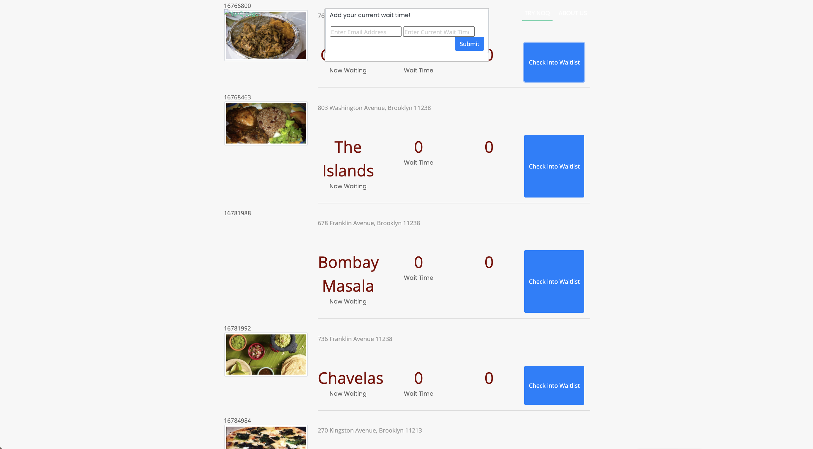
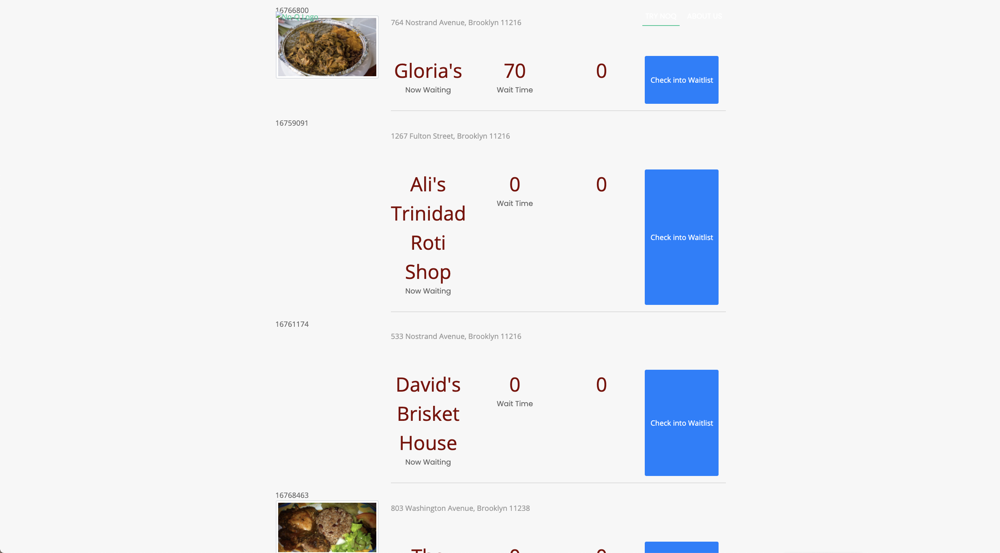

Began as a class group project, Team-Lately is a React app using location services, MySQL, and the Zomato restaurant API to crowdsource wait times at popular restaurants that was completed by me after class ended.

## Getting Started

To install this software, either clone or download and extract the files to a location of your choosing on your computer. To clone the repository, copy the clone link, open a terminal window and enter "git clone (https://github.com/seanhellier/team-lately.git)"

After cloning the repository on your machine, open a terminal session, navigate to the root folder of the repository, then run "npm install" to install the dependencies).

After installing the dependencies, enter "npm start" in the terminal window and you should see the process create the database and launch the app on port 3000.

Upon launch, click the "Start" button to locate a list of restaurants near you, derived by Location Services on your device. If current wait times have been posted, they will be shown beside the restaurant name and address.

To add a wait time for a restaurant, click the "Check In To Waitlist" button and add your email address and wait time.

### Deployment

To deploy this software on a webserver, copy the containing folder to your server's public directory and follow any instructions required by your Internet Hosting Providor (IHP) or server administrator.

## Built With

- [Bootstrap](http://www.getbootstrap.com) - The CSS framework used for the skin
- [Javascript](https://www.javascript.com/) - Used for functionality
- [React](https://reactjs.org/) - The javascript framework used for the site architecture
- [Handlebars](https://handlebarsjs.com/) - Used for templeting and content management
- [MySQL](https://www.mysql.com/) - Used for back end databasing

## Contributing

Please read [CONTRIBUTING.md](https://github.com/seanhellier/slh_portfolio/blob/master/contributing.md) for details on my code of conduct, and the process for submitting pull requests to us.

## Versioning

We use [SemVer](http://semver.org/) for versioning. For the versions available, see the [tags on this repository](https://github.com/your/project/tags).

## Authors

- **Sean Leif Hellier** - _Initial work:_
  _ [Website](http://www.seanhellier.com)
  _ [Github](https://github.com/seanhellier/slh_portfolio)

## License

This project is licensed under the MIT License - see the [LICENSE.md](LICENSE.md) file for details

## Deployment

[Heroku](https://team-lately.herokuapp.com/#searchBtn)
[Github](https://github.com/seanhellier/team-lately)
